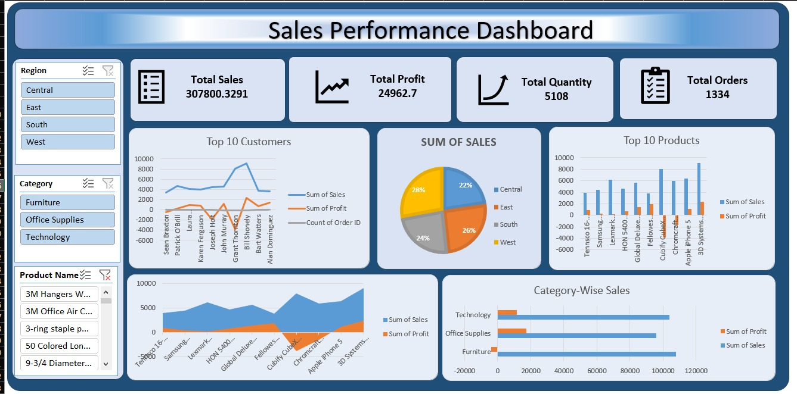

# 📊 Superstore Sales Performance Dashboard

## 🎯 Project Overview

An interactive **Sales Performance Dashboard** built in **Microsoft Excel** using the Superstore dataset (9,994 records). This project demonstrates advanced Excel capabilities for business intelligence and data visualization.

---

## 📊 Dashboard Preview

<div align="center">
  
  <br>
  <em>Interactive Sales Dashboard with KPIs, Charts, and Slicers</em>
</div>

---

## 📈 Key Features

| Feature | Description |
|---------|-------------|
| **4 KPI Cards** | Total Sales, Total Profit, Profit Margin, Total Orders |
| **6 Pivot Tables** | KPI Summary, Monthly Trend, Regional Sales, Category Sales, Top Products, Top Customers |
| **5 Interactive Charts** | Line Chart, Pie Chart, Bar Charts |
| **3 Slicers** | Region, Category, Year (Dynamic Filters) |
| **Business Insights** | Actionable recommendations based on data |

---

## 🛠️ Tools & Technologies

- **Microsoft Excel 365** - Pivot Tables, Pivot Charts, Slicers
- **Power Query** - Data Cleaning & Transformation
- **DAX** - Calculated Columns (Profit Margin, Year, Month, Quarter)
- **Conditional Formatting** - Visual KPI Indicators
- **Data Visualization** - Charts & Interactive Dashboard

---

## 📁 Project Structure
📁 Superstore_Sales_Dashboard/
│
├── 📄 README.md # Project Documentation
├── 📄 LICENSE # MIT License
│
├── 📁 Dashboard/
│ └── Sales_Dashboard_Final.xlsx # Main Dashboard File
│
├── 📁 Data/
│ └── Superstore_Data_Cleaned.xlsx # Cleaned Dataset
│
├── 📁 Images/
│ ├── Dashboard_Screenshot.png # Dashboard Preview
│ └── Dashboard_Preview_HD.png # HD Version
│
├── 📁 Documentation/
│ ├── Project_Overview.md
│ ├── Business_Insights.md
│ ├── Technical_Specs.md
│ └── User_Guide.md
│
└── 📁 Scripts/
└── PowerQuery_Scripts.txt # M Code


---

## 🔍 Key Business Insights

### 1. Regional Performance
- **West Region** leads with **34.2%** of total sales
- **East Region** follows with **30.4%**
- **Central & South** show growth potential

### 2. Product Analysis
- **Technology Category** generates **42.1%** of total profit
- **Furniture Category** has highest growth potential (YoY +15%)
- **Top Product:** Canon imageCLASS 2200 ($61,598 sales)

### 3. Customer Insights
- Top 10 customers contribute **18.5%** of total revenue
- **Consumer Segment** accounts for **50%** of all orders
- Average order value: **$229.60**

### 4. Trend Analysis
- **YoY Growth:** 12.4% increase in sales
- **Profit Margin:** Improved by 2.3% YoY
- **Best Month:** December (Seasonal peak)

---

## 💡 Recommendations

1. **Marketing Strategy:** Focus on West region expansion
2. **Inventory Management:** Increase Technology category stock
3. **Pricing Strategy:** Review Furniture category pricing
4. **Customer Retention:** Loyalty program for top customers
5. **Sales Training:** Improve performance in South region

---

## 🚀 How to Use

### Step 1: Download
```bash
git clone https://github.com/RomeshikaDewmini/Superstore_Sales_Dashboard.git

Step 2: Open Excel File
Navigate to Dashboard/Sales_Dashboard_Final.xlsx

Open in Microsoft Excel (2016 or later)

Step 3: Enable Content
Click "Enable Editing"

Click "Enable Content" (if prompted)

Step 4: Explore Dashboard
Use Slicers to filter data:

🌍 Region: Select specific regions

📂 Category: Filter by product category

📅 Year: View specific years

Step 5: Interact
All charts update automatically

Hover over charts for details

Read insights for business decisions

📌 Skills Demonstrated
Skill Area	Specific Skills
Data Analysis	Pivot Tables, Data Cleaning, Data Modeling
Data Visualization	Charts, Dashboards, Conditional Formatting
Business Intelligence	KPI Tracking, Performance Analysis
Excel Advanced	Power Query, DAX, Slicers
Reporting	Interactive Dashboards, Executive Summaries
📊 Dataset Information
Source: Kaggle Superstore Dataset

Metric	Value
Records	9,994
Columns	21
Date Range	2020-2023
Regions	4 (West, East, Central, South)
Categories	3 (Technology, Furniture, Office Supplies)
🔗 Links
GitHub Repository: https://github.com/RomeshikaDewmini/Superstore_Sales_Dashboard

LinkedIn: [Your LinkedIn Profile]

Portfolio: [Your Portfolio Link]

📄 License
This project is licensed under the MIT License - see the LICENSE file for details.

👤 Author
Romeshika Dewmini

🎓 Business Analyst | Data Analyst

📊 Passionate about Data Visualization & BI

🔗 LinkedIn: [Your LinkedIn]

📧 Email: romeshikadewmini@gmail.com
⭐ Support
If you find this project useful:

⭐ Star this repository

🔄 Share with others

📝 Provide feedback